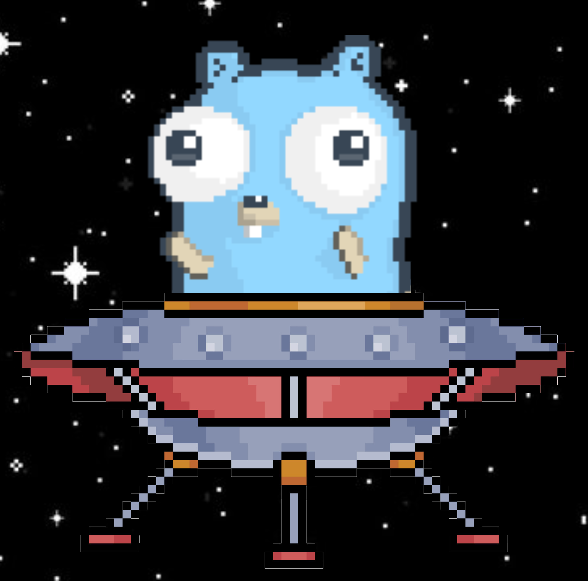

<a name="readme-top"></a>

<!-- PROJECT SHIELDS -->

[![Contributors][contributors-shield]][contributors-url]
[![Forks][forks-shield]][forks-url]
[![Stargazers][stars-shield]][stars-url]
[![Issues][issues-shield]][issues-url]
[![MIT License][license-shield]][license-url]

<!-- PROJECT LOGO -->
<br />
<div align="center">
  <a href="https://github.com/amir002001/ogmir">
    
  </a>

<h3 align="center">ogmir</h3>

  <p align="center">
    a blazinlgy-fast, batteries-included-but-swappable, Opengraph image generator rest endpoint using the DevTools API
    <br />
    <!-- <a href="https://github.com/amir002001/ogmir"><strong>Explore the docs »</strong></a> -->
    <br />
    <br />
    <a href="https://github.com/amir002001/ogmir/issues">Report Bug</a>
    ·
    <a href="https://github.com/amir002001/ogmir/issues">Request Feature</a>
  </p>
</div>

<!-- TABLE OF CONTENTS -->
<details>
  <summary>Table of Contents</summary>
  <ol>
    <li>
      <a href="#about-the-project">About The Project</a>
      <ul>
        <li><a href="#built-with">Built With</a></li>
      </ul>
    </li>
    <li>
      <a href="#getting-started">Getting Started</a>
      <ul>
        <li><a href="#prerequisites">Prerequisites</a></li>
        <li><a href="#installation">Installation</a></li>
        <li><a href="#cicd">CI/CD</a></li>
      </ul>
    </li>
    <li><a href="#roadmap">Roadmap</a></li>
    <li><a href="#contributing">Contributing</a></li>
    <li><a href="#license">License</a></li>
    <li><a href="#contact">Contact</a></li>
  </ol>
</details>

<!-- ABOUT THE PROJECT -->

## About The Project

[![Product Name Screen Shot][product-screenshot]](https://example.com)

Are you tired of your Twitter links looking like this:
[![Boring Twitter Link][product-screenshot]](https://example.com)

Well you should check this project out. I made this project out of passion for go and a lack of a good open-source starting point for generating open graph images using Go.
Bootstrap

There are many ways of achieving similar results. Vercel OG Image offers a serverless solution that can only be used on Next.JS. You could also use fogleman/gg to draw a canvas and export that as an image, but you won't have access to fancy CSS, DOM utilities, etc.

The basic idea is to use Go templates to generate HTML on the fly based on query parameters, screenshot the DOM element, and return it as a response.

To enable better performance I've added a caching layer as well using an on-disk SQLite DB. It proves fine for my use case right now. Could very well be hot-swapped for a Redis cache or an S3, Blob Storage solution.

Same concept was also used for a rate-limiter to reduce abilities of malicious actors. To further improve security you can reject requests that don't come from your bucket.

This is a project I created and will be maintaining for my blog engine at [amir.day](https://amir.day).

Thank you to the maintainers of Go Fiber and Go Rod for such a well-maintained API. I had a blast writing this and I'm glad to see it works.

I have a **fly.toml** file in the root directory and a github action you could use to deploy your service as well but feel free to use anything from Azure app service to cloud run, etc. to deploy it.

<p align="right">(<a href="#readme-top">back to top</a>)</p>

### Built With

- [![Golang][Golang]][Golang-url]
- [![Sqlite][Sqlite]][Sqlite-url]
- [![Docker][Docker]][Docker-url]

<p align="right">(<a href="#readme-top">back to top</a>)</p>

<!-- GETTING STARTED -->

## Getting Started

For the template itself, I suggest using the sample HTML file in the root directory to get a good sense of what you want your markup to look like and then port it over to the template HTML.

For running and debugging the Go code, either rebuild the container every time (the install layers will all be cached and only the build step is repeated), or volume mount the src folder into a slightly modified Alpine image with the required packages installed.

You could also build and run locally if you have the chromium binary in your path. It might be a different name than the one Alpine wants, so you might want to add a sim-link or rename it in the code.

### Deployment

These steps are for people deploying to fly. Feel free to change it up for your use case

1. Get a fly.io account
2. Get and authenticate to the fly CLI
   ```sh
   brew install flyctl
   fly auth login
   ```
3. Clone the repo
   ```sh
   git clone https://github.com/amir002001/ogmir
   ```
4. Create and deploy fly app
   ```sh
   fly launch
   ```
5. Ping your endpoint
   ```bash
   curl -o "image.png" "<my-app>.fly.io/api/v1/ogmir?title=foo&image=bar"
   ```

### CI/CD

I have it setup to deploy to fly on pushes to main branch, to achieve this, get a deploy token for your app and add it to github secrets. The workflow will pick it up.

<p align="right">(<a href="#readme-top">back to top</a>)</p>

<!-- ROADMAP -->

## Roadmap

- [ ] Limit to only enable calls from my cloudinary instance
- [ ] add MIT license

See the [open issues](https://github.com/amir002001/ogmir/issues) for a full list of proposed features (and known issues).

<p align="right">(<a href="#readme-top">back to top</a>)</p>

<!-- CONTRIBUTING -->

## Contributing

Contributions are what make the open source community such an amazing place to learn, inspire, and create. Any contributions you make are **greatly appreciated**.

If you have a suggestion that would make this better, please fork the repo and create a pull request. You can also simply open an issue with the tag "enhancement".
Don't forget to give the project a star! Thanks again!

1. Fork the Project
2. Create your Feature Branch (`git checkout -b feature/AmazingFeature`)
3. Commit your Changes (`git commit -m 'Add some AmazingFeature'`)
4. Push to the Branch (`git push origin feature/AmazingFeature`)
5. Open a Pull Request

<p align="right">(<a href="#readme-top">back to top</a>)</p>

<!-- LICENSE -->

## License

Distributed under the MIT License. See `LICENSE.txt` for more information.

<p align="right">(<a href="#readme-top">back to top</a>)</p>

<!-- CONTACT -->

## Contact

Amir Azizafshari - [@AmirLovesKiwis](https://twitter.com/amirloveskiwis) - its@amir.day

Project Link: [https://github.com/amir002001/ogmir](https://github.com/amir002001/ogmir)

<p align="right">(<a href="#readme-top">back to top</a>)</p>

<!-- MARKDOWN LINKS & IMAGES -->
<!-- https://www.markdownguide.org/basic-syntax/#reference-style-links -->

[contributors-shield]: https://img.shields.io/github/contributors/amir002001/ogmir.svg?style=for-the-badge
[contributors-url]: https://github.com/amir002001/ogmir/graphs/contributors
[forks-shield]: https://img.shields.io/github/forks/amir002001/ogmir.svg?style=for-the-badge
[forks-url]: https://github.com/amir002001/ogmir/network/members
[stars-shield]: https://img.shields.io/github/stars/amir002001/ogmir.svg?style=for-the-badge
[stars-url]: https://github.com/amir002001/ogmir/stargazers
[issues-shield]: https://img.shields.io/github/issues/amir002001/ogmir.svg?style=for-the-badge
[issues-url]: https://github.com/amir002001/ogmir/issues
[license-shield]: https://img.shields.io/badge/License-MIT-yellow.svg?style=for-the-badge
[license-url]: https://github.com/amir002001/ogmir/blob/master/LICENSE
[Next.js]: https://img.shields.io/badge/next.js-000000?style=for-the-badge&logo=nextdotjs&logoColor=white
[Golang-url]: https://go.dev/
[Golang]: https://img.shields.io/badge/Go-00ADD8?style=for-the-badge&logo=go&logoColor=white
[Sqlite-url]: https://go.dev/
[Sqlite]: https://www.sqlite.org/
[Docker]: https://img.shields.io/badge/docker-%230db7ed.svg?style=for-the-badge&logo=docker&logoColor=white
[Docker-url]: https://docker.com
